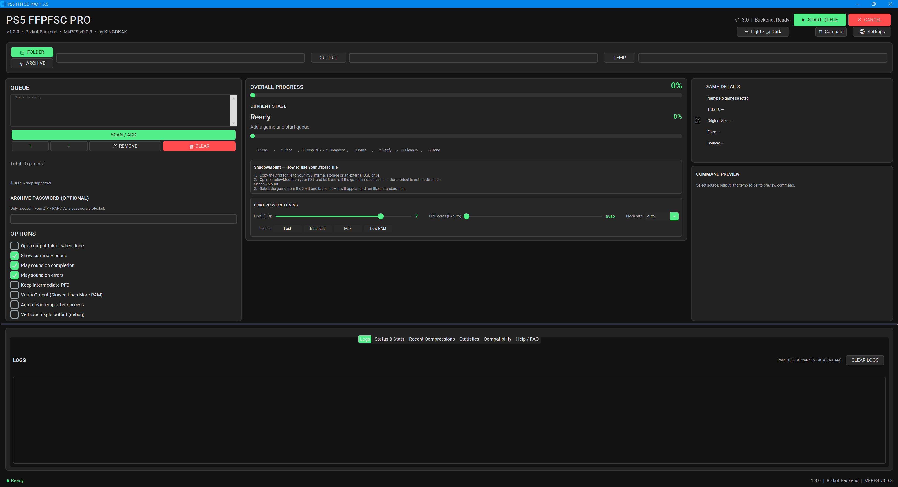
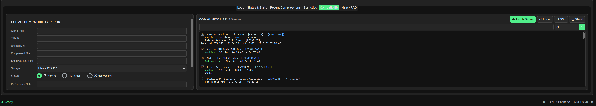
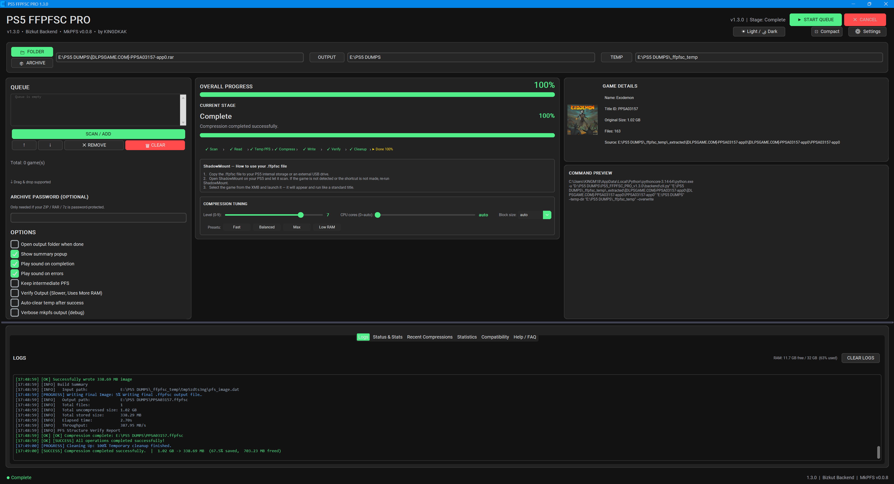

<h1 align="center">PS5 FFPFSC PRO (fork)</h1>

<p align="center">
  PS5 game compression utility — a fork of
  <a href="https://github.com/KINGDKAK/PS5-FFPFSC-PRO">KINGDKAK/PS5-FFPFSC-PRO</a>
  with a flexible layout, an English / Turkish interface and workflow fixes
</p>

<p align="center">
  
  
  
  
</p>

<p align="center">
  <a href="https://github.com/KINGDKAK/PS5-FFPFSC-PRO">Upstream project</a> •
  <a href="https://github.com/KINGDKAK/PS5-FFPFSC-PRO/releases">Upstream releases</a> •
  <a href="https://youtube.com/@KINGDKAK">Upstream YouTube</a> •
  <a href="https://ko-fi.com/KINGDKAK">Support the upstream author (Ko-fi)</a>
</p>

---

PS5 FFPFSC PRO is a GUI for compressing PlayStation 5 game dumps into `.ffpfsc`
images with MkPFS, built on the [bizkut/ps5-ffpfs-cli](https://github.com/bizkut/ps5-ffpfs-cli)
backend. The original application is developed by
[KINGDKAK](https://github.com/KINGDKAK/PS5-FFPFSC-PRO); this repository is a fork
that adds interface, workflow and bug-fix work on top of upstream **v1.3.0**.

## What this fork changes / Bu fork neyi değiştiriyor

The compression itself (the bundled MkPFS 0.0.9) is unchanged. The fork's changes
are in the GUI (`PS5_FFPFSC_PRO_v1.4.0.py`) and in the backend wrapper
(`backend/cli.py`), plus UTF-8-safe log output in `backend/mkpfs/logging.py`.
The full list is in [`CHANGELOG.txt`](CHANGELOG.txt) under v1.4.0.

Sıkıştırmanın kendisi (paketle gelen MkPFS 0.0.9) değiştirilmemiştir. Değişiklikler
arayüzde (`PS5_FFPFSC_PRO_v1.4.0.py`), arka uç sarmalayıcısında (`backend/cli.py`)
ve `backend/mkpfs/logging.py` içindeki UTF-8 güvenli günlük çıktısındadır.

### Flexible layout — Esnek tasarım

* The window opens to fit the usable desktop and honours Windows display
  scaling. The old fixed 1400x960 became 1750x1200 at 125% scaling and pushed
  controls (the CPU-core slider among them) off the screen.
* The three columns — queue, progress, details — sit behind **draggable sashes**,
  so any column can be widened or narrowed.
* Every column scrolls independently, so nothing is stranded below the window
  edge on a small screen. Labels re-wrap live as a column is resized.
* New **Reset Layout** button restores the default pane sizes.
* The queue list gained a horizontal scrollbar, and the mouse wheel scrolls the
  list under the pointer instead of the column behind it.

*Pencere, masaüstüne ve Windows ölçeklemesine göre açılır; üç sütun sürüklenerek
genişletilip daraltılabilir, her sütun ayrı kaydırılır, "Reset Layout" ile
varsayılan düzene dönülür.*

### Turkish / English interface — Türkçe / İngilizce arayüz

* An **EN / TR** button in the header switches the whole interface live, and the
  choice is remembered between runs.
* Backend log output stays English on purpose, so logs can still be shared for
  support.

*Başlıktaki EN / TR düğmesi arayüzü anında değiştirir ve seçim kaydedilir.*

### Skip already-compressed games — Aynı oyunu tekrar sıkıştırmama

* New option **"Skip games that are already compressed"** (on by default).
* Finished games are dropped from the queue before a batch starts, and the
  backend enforces the same rule through a new `--skip-existing` flag — which
  also covers `--batch` runs the GUI cannot pre-check.
* Both the old `TITLEID.ffpfsc` and the new `TITLEID-Game Name.ffpfsc` layouts
  are recognised, so games compressed by earlier versions still count as done.

*Çıktı klasöründe zaten .ffpfsc'si olan oyunlar yeniden sıkıştırılmaz.*

### Output named after the game — Oyun ismiyle çıktı

* Output is now `TITLEID-Game Name.ffpfsc` instead of `TITLEID.ffpfsc`, read from
  the game's own `sce_sys/param.json` and falling back to the folder name.
* Characters Windows rejects are replaced rather than dropped
  (`NieR:Automata` → `NieR Automata`), the name is trimmed to a sane length, and
  a title ID already present in the source name is not repeated.

*Çıktı dosyası `OYUNKODU-Oyun Adı.ffpfsc` biçiminde adlandırılır.*

### Bug fixes — Hata düzeltmeleri

* **UnicodeEncodeError on Turkish Windows** — with stdout redirected to a pipe,
  Python fell back to the ANSI codepage (cp1254) and crashed on the icons mkpfs
  prints, killing builds that had actually finished. All pipes are UTF-8 now and
  log output degrades instead of raising.
* **exFAT is no longer flagged as 4 GB limited** — only FAT32/FAT caps a single
  file at 4 GB; exFAT exists to lift that limit and is a valid output target.
* **Free space is checked the way mkpfs checks it** — mkpfs reserves free space
  equal to the full *uncompressed* source size before it starts, so that is what
  is verified, before the run rather than hours into it.
* **The space dialog blocks a doomed run** instead of auto-proceeding, and says
  what is missing and by how much.
* **Error hints report the cause that actually holds** rather than blaming the
  output filesystem for every failure.
* Settings toggled in the main window (skip existing, auto-clear temp) are saved
  immediately.
* Fixed the "'Text' object is not callable" crash in the progress poll loop.
* The updater tracks this fork's releases, and treats "no release published yet"
  as up to date instead of an error.

*Türkçe Windows'ta derlemeyi öldüren UTF-8 hatası, exFAT'in yanlışlıkla 4 GB
sınırlı sayılması, boş alan denetimi, `_poll` döngüsündeki çökme ve bir dizi başka
hata düzeltildi.*

---

## Screenshots

*Screenshots are from the upstream project.*

### Main Window



### Community Compatibility Database



### Compression Progress



---

## Features

* Compress PS5 game dumps into `.ffpfsc`
* Flexible layout — resizable, independently scrollable columns *(fork)*
* English / Turkish interface *(fork)*
* Skips games that are already compressed *(fork)*
* Output named after the game: `TITLEID-Game Name.ffpfsc` *(fork)*
* Inputs: game folders, `.exfat` and `.ffpkg` images, `.zip`, `.rar` and `.7z` archives
* Drag-and-drop and multi-image queueing
* Batch compression
* Compression tuning and presets
* Automatic update checker
* Live RAM meter
* Automatic retry on out-of-memory errors
* Detailed logs and progress tracking
* Per-game output folders (`output/GameName/`)
* Compact mode
* Interactive feature tour and What's New dialog
* Help / FAQ tab
* Community Compatibility Database
* APR / AMPR game support

---

## Installation

This fork does not publish prebuilt executables yet. Run it from source or build
the executable yourself. Prebuilt binaries of the original application (without
this fork's changes) are on the [upstream releases page](https://github.com/KINGDKAK/PS5-FFPFSC-PRO/releases).

### Run from source (Windows)

`RUN.bat` installs the Python dependencies and starts the application:

```bat
RUN.bat
```

which is equivalent to:

```bat
py -m pip install customtkinter pillow mkpfs==0.0.9 tkinterdnd2 py7zr rarfile cryptography
py PS5_FFPFSC_PRO_v1.4.0.py
```

On other platforms, install the same packages with `pip` and start
`PS5_FFPFSC_PRO_v1.4.0.py` with Python 3. `customtkinter` is required;
`tkinterdnd2` (drag and drop) and `pillow` are optional; `py7zr` and `rarfile`
are used for `.7z` and `.rar` input; `cryptography` is needed by MkPFS.
The backend uses the MkPFS copy bundled in `backend/mkpfs/`.

### Build the executable (Windows)

```bat
BUILD_EXE.bat
```

The script installs the dependencies and PyInstaller, syntax-checks
`PS5_FFPFSC_PRO_v1.4.0.py` and `backend\cli.py`, and builds
`PS5_FFPFSC_PRO_v1.4.0.spec`. The result is `dist\PS5_FFPFSC_PRO.exe`, with the
`backend/` folder bundled inside.

---

## Usage

1. Start the application (`RUN.bat`, or `dist\PS5_FFPFSC_PRO.exe` after building).
2. Add a game folder, archive, `.exfat`, or `.ffpkg` image.
3. Select your compression settings.
4. Click **Start**.

Settings, history and the cached compatibility list are stored in
`%APPDATA%\PS5_FFPFSC_PRO_BIZKUT` (the home directory on systems without
`APPDATA`).

### Backend command line

The GUI drives `backend/cli.py`, which can also be used directly:

```bash
python backend/cli.py <game_folder | .exfat | .ffpkg> [output] [options]
```

| Option | Meaning |
|---|---|
| `--batch` | Process all games / images found under the source; `output` is a directory |
| `--skip-existing` | Skip a game when a `.ffpfsc` for its title ID is already in the output folder *(fork)* |
| `-f`, `--force`, `--overwrite` | Overwrite existing files |
| `--password PASSWORD` | Password for ZIP/RAR archives |
| `--compression-level 0-9` | Zlib compression level (default 9) |
| `--cpu-count N` | CPU cores for compression (0 = auto, default) |
| `--block-size` | `auto` (65536, default), `auto-fit`, or a size in bytes |
| `--threshold-gain PCT` | Minimum per-block gain to keep a block compressed (default 5) |
| `--temp-dir DIR` | Folder for intermediate files (default: system temp) |
| `--verify` | Run MkPFS post-build verification (slower, more RAM) |
| `--keep-pfs` | Keep the intermediate PFS image |
| `--verbose` | Verbose per-file MkPFS output |

---

## Community Compatibility Database

After a successful compression, you can optionally submit your results to the
community database (maintained by the upstream project).

The database allows users to:

* Share compatibility reports (Working / Partial / Not Working / Not Tested Yet)
* Search by game name or Title ID, and filter by status
* View report counts and ShadowMount version information
* Browse and submit reports directly from the application
* Browse 5,000+ community compatibility reports

Compatibility status is vote-based, so one incorrect report cannot override
community results, and resubmitting the same game replaces the existing entry.

View the live compatibility database:
<https://docs.google.com/spreadsheets/d/1dgu0p7U2yB_mhcUELz-Wkc7Yhs-avoWLY1Gcm0n5XJw/edit>

`google_apps_script.js` is the Google Apps Script behind the sheet (POST receives
a report from the app, GET returns the data for the in-app viewer).

---

## Compression Tuning

Advanced users can fine-tune compression using:

* Compression level
* CPU cores
* Block size: `auto`, `auto-fit`, `65536`, `32768`, `16384`

Smaller block sizes may improve results for games containing large numbers of
small files.

Presets set compression level, CPU cores and block size together:

| Preset | Settings |
|---|---|
| Fast | level 3, auto cores, auto block |
| Balanced | level 5, auto cores, auto block |
| Max | level 9, auto cores, auto block |
| Low RAM | level 5, 1 core, 16384 block |

---

## AMPR / APR Support

PS5 FFPFSC PRO can detect games that require the AMPR emulator:

* Automatic APR title detection (via `sce_sys/playgo-chunk.dat`)
* Asks before compression when a title is not detected automatically
* Dedicated AMPR emulator folder setting
* `fakelib/` injection of `libSceAmpr.sprx` and `libScePlayGo.sprx`
* AMPR index (`ampr_emu.index`) built automatically by MkPFS
* Works in single-game and batch mode

---

## Common Issues

### Out of Memory

Try:

* Lowering CPU cores
* Lowering compression level
* Unchecking *Verify Output*
* Closing other applications

### Disk Full

MkPFS requires free space equal to the full uncompressed source size on the
output drive. Ensure sufficient free space exists in both the output folder and
the temporary folder.

### Write Errors

Verify that:

* Output locations are valid
* Drives are writable (FAT32 limits single files to 4 GB; exFAT and NTFS do not)
* Storage devices have enough free space

The application provides detailed error messages and recommended fixes whenever
possible.

---

## Repository layout

```
PS5_FFPFSC_PRO_v1.4.0.py     GUI application (CustomTkinter)
PS5_FFPFSC_PRO_v1.4.0.spec   PyInstaller spec (output: PS5_FFPFSC_PRO.exe)
RUN.bat                      install dependencies and run from source
BUILD_EXE.bat                build the Windows executable
CHANGELOG.txt                version history (v1.0 – v1.4.0)
google_apps_script.js        Apps Script for the community compatibility sheet
backend/                     bizkut/ps5-ffpfs-cli backend
  cli.py                       command-line backend driven by the GUI
  mkpfs/                       bundled MkPFS 0.0.9
  unrar/                       UnRAR C++ extension for RAR input
screenshots/                 README images
```

---

## Credits

* **Original application:** [KINGDKAK/PS5-FFPFSC-PRO](https://github.com/KINGDKAK/PS5-FFPFSC-PRO)
  — original design and features (v1.0 – v1.3.0).
* **Backend:** [bizkut/ps5-ffpfs-cli](https://github.com/bizkut/ps5-ffpfs-cli)
  with MkPFS (bundled in `backend/mkpfs/`); RAR support via the UnRAR source in
  `backend/unrar/`.
* **This fork (v1.4.0 changes):** [ufukasia](https://github.com/ufukasia).
* **Community:** everyone testing games, submitting compatibility reports and
  reporting bugs.

## License

Neither this fork nor the upstream repository contains a license file. All rights
to the original application remain with its upstream author; the bundled backend
and third-party components remain under their own authors' terms.

## Disclaimer

This project is provided as-is. Only use content you legally own and follow all
applicable laws in your region.

## Contact

Fork maintainer: Dr. Ufuk Asil ([@ufukasia](https://github.com/ufukasia)).
For the original application, see the
[upstream project](https://github.com/KINGDKAK/PS5-FFPFSC-PRO).
